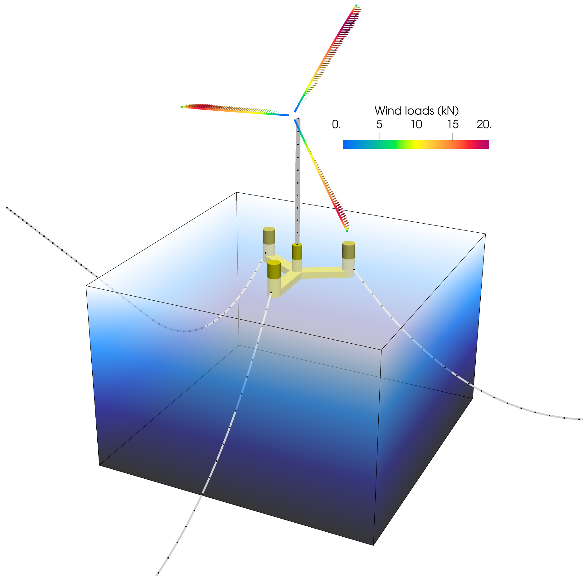
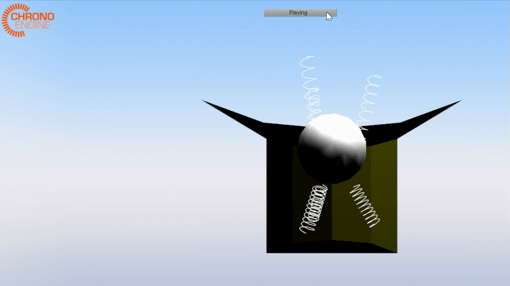

# What is HydroChrono?

HydroChrono is an advanced hydrodynamics package for simulating complex ocean systems. Its designed to integrate seamlessly with the open-source physics engine, [Project Chrono](https://projectchrono.org/) through a robust C++ API.

  

  <video width="500" controls>
    <source src="doc/user/sphere_irreg.webm" type="video/webm" width="500" alt="A simple sphere in irregular waves.">
    Your browser does not support the video tag.
  </video>

# Capabilities of HydroChrono

With HydroChrono, you can model any system that's supported by Chrono - from multiple bodies and joints to finite element bodies and discrete element particles. HydroChrono will supply hydrodynamic forces to any rigid body in the system - whether you're looking to simulate multibody wave energy converters (WECs) or floating offshore wind turbines (FOWTs) with flexible towers and blades through Chrono::FEA.

Here is an example of a floating wind turbine with flexible tower and blades where HydroChrono is supplying wave forces to the (rigid body) floating platform:

  

And here is a cutaway view of multibody WEC (TALOS) with 6 PTOs connecting the hull to a large internal reaction mass. HydroChrono is supplying wave forces to the hull:

  

# Dive Deeper 🏊‍♂️

For more detailed information about HydroChrono please visit the [HydroChrono website](https://nrel.github.io/HydroChrono/). This website covers the theory behind the code in more detail, along with instructions for how to build the code and start using it.

As of now, HydroChrono must be built from source. While this provides flexibility for customization and optimization, it also means that the setup process may be more involved than a pre-compiled solution. For detailed build instructions, please refer to our HydroChrono website. We are continually working to improve the installation process and appreciate your feedback and patience!

# Limitations of HydroChrono

Like all tools, HydroChrono has its own set of limitations:

- **First-order potential flow forces:** we currently support first-order potential flow forces; more complex/nonlinear options have not yet been implemented.
- **Rigid bodies:** while flexible bodies can be included in a system, at the moment we only support hydrodynamic forces applied to rigid bodies.

We welcome feedback and contributions to help us address these limitations!

# Long-term Goals & Vision

- **Develop advanced simulation capabilities:** HydroChrono opens up several new simulation possibilities, including:
    - Simulation of anchor-seabed interactions for WECs and FOWTs using both the DEM (Discrete Element Method) and FEA (Finite Element Analysis) modules available in Project Chrono.
    - Distributed hydrodynamic loads on flexible structures through the use of Chrono::FEA. This not only allows for in-depth structural analysis but also the simulation of innovative deformable and/or inflatable WECs.
- **Deeper Integration with the Chrono Ecosystem:** We envision a seamless transition of system models across various fluid dynamics realms. From HydroChrono's potential flow to Computational Fluid Dynamics (CFD) and Smoothed Particle Hydrodynamics (SPH), our goal is to offer detailed Fluid-Structure Interaction (FSI) insights. This will aid researchers in understanding intricate nonlinear FSI scenarios before actual ocean deployments. Additionally, we want to support rapid estimation of viscous drag coefficients to help refine HydroChrono's potential flow models.
- **Expanding Accessibility with a Python API:** Recognizing the global research community's diverse coding preferences, we're working towards introducing a Python API for HydroChrono. This will provide a more accessible interface and reduce the reliance on C++ for many users.
- **Advocating for Open-Source Collaboration:** At the heart of HydroChrono lies the spirit of innovation driven by open-source collaboration. We highly value open-source solutions and strongly encourage collaborations!
