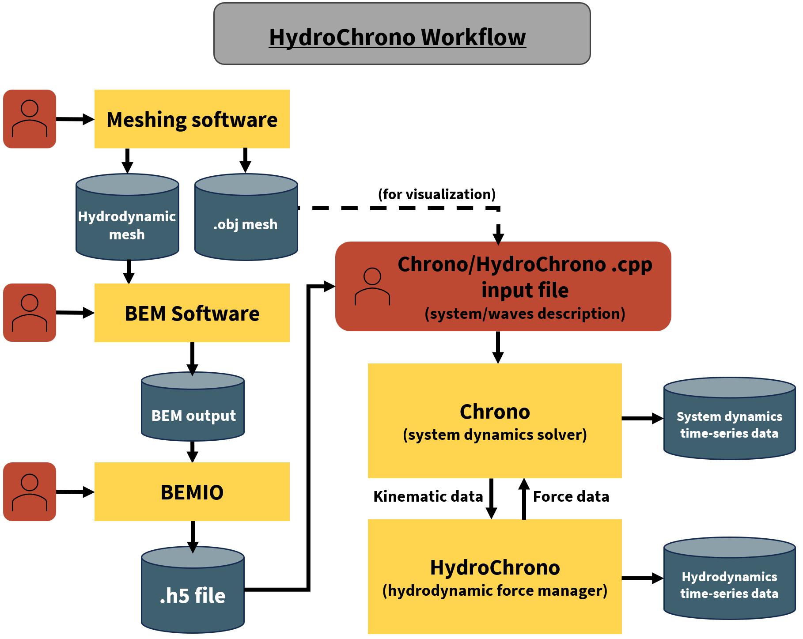

.. _label-workflow:

Workflow
========

Introduction
------------

This page outlines the typical workflow for using HydroChrono to simulate hydrodynamic loads on bodies. It covers the stages from mesh creation to data output.

Mesh Creation
-------------

1. Create a mesh representing the bodies in the system that will experience hydrodynamic loads.
    - A good option for scripting meshes is Pygmsh - which is handy for automating the design exploration process. Alternatively, conventional CAD software like Rhino can export commonly used mesh file formats (e.g. .gdf)
2. Save the mesh in the format required by your chosen Boundary Element Method (BEM) code. For instance, use:
    - `.gdf` format for WAMIT
    - Multiple formats for Capytaine
3. Additionally, save the mesh in `.obj` format for visualization purposes in Chrono.

Hydrodynamic Coefficients Calculation
-------------------------------------

1. Input the mesh into the BEM code to compute hydrodynamic coefficients.
2. Process the BEM outputs and convert them into the `.h5` format using BEMIO.

Chrono Model Creation
---------------------

1. Set up the Chrono model for the system using Chrono's C++ API. Define all the bodies, joints, and any subsystems as needed.
2. Specify the `.h5` file as an input along with the desired wave conditions.
3. Compile the model's input file, which will produce a binary executable, making the model ready for execution.

Run the Model
-------------

1. HydroChrono ensures that the full dense added mass matrix is integrated into the mass matrix that Chrono resolves.
2. The hydrodynamic functions are represented as Chrono `ChFunctions`. In essence, Chrono is efficiently solving the complete Cummins equation through a tightly-coupled approach.

Data Output
-----------

1. Time-series data can be obtained and saved using the standard options available in Chrono.