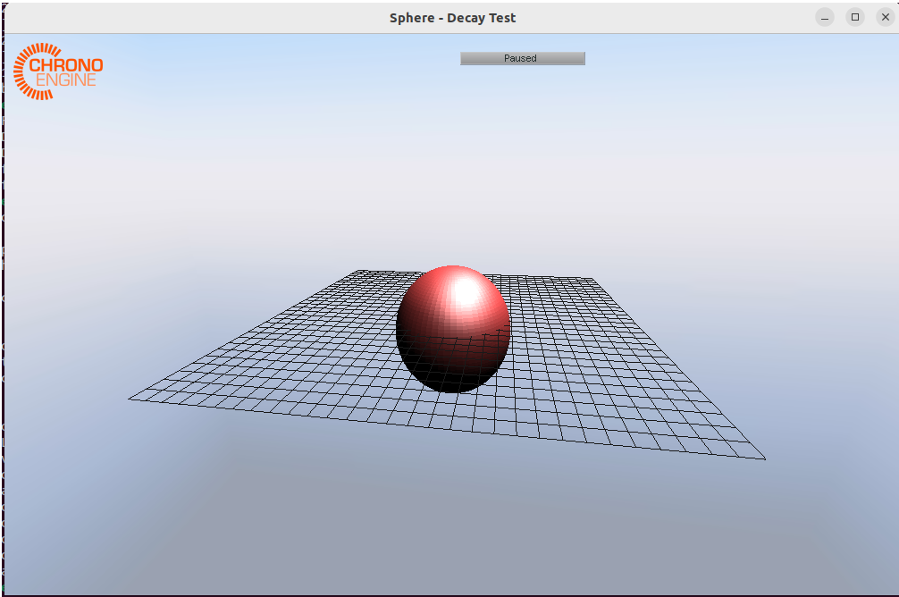

###############################################################
Sphere Decay - Case 1
###############################################################

Overview
======================

A floating sphere under gravity field. Compute heave decay

	- Reference from :ref:`ref-SPH_Decay`.

Geometry
======================

To complete ......

   3D Simple sphere

Body 1: Sphere
-----------------

Radius math:`R = 5` m.
See the different properties of this geometry are given below
in :ref:`tab-sd01`.

Physical parameters
======================

To complete ....

Center of Buoyancy, center of gravity, volume displacement, ....

.. _tab-sd01:

.. csv-table:: properties
	:file: prop_parameters.csv
	:align: center
	:header-rows: 1
	:widths: 36, 12, 12, 16

To complete

.. csv-table:: Initial and boundary conditions
	:file: icbc_parameters.csv
	:align: center
	:header-rows: 1
	:widths: 36, 12, 12, 12

Numerical parameters
======================

The simulation final time was set to :math:`t_f = 10` s.

..  :download:`Input files <input_files.zip>`

Results
======================

The analytical solution for decay ...

blabla

.. plot:: _validation/demos/sphere_decay/plot_01.py

.. _ref-SPH_Decay:

Reference "Sphere Decay"
========================

Kramer, Andersen, et al. 2021, "Highly Accurate Experimental Heave Decay Tests with a Floating Sphere: A Public Benchmark Dataset for Model Validation of Fluid–Structure Interaction"
