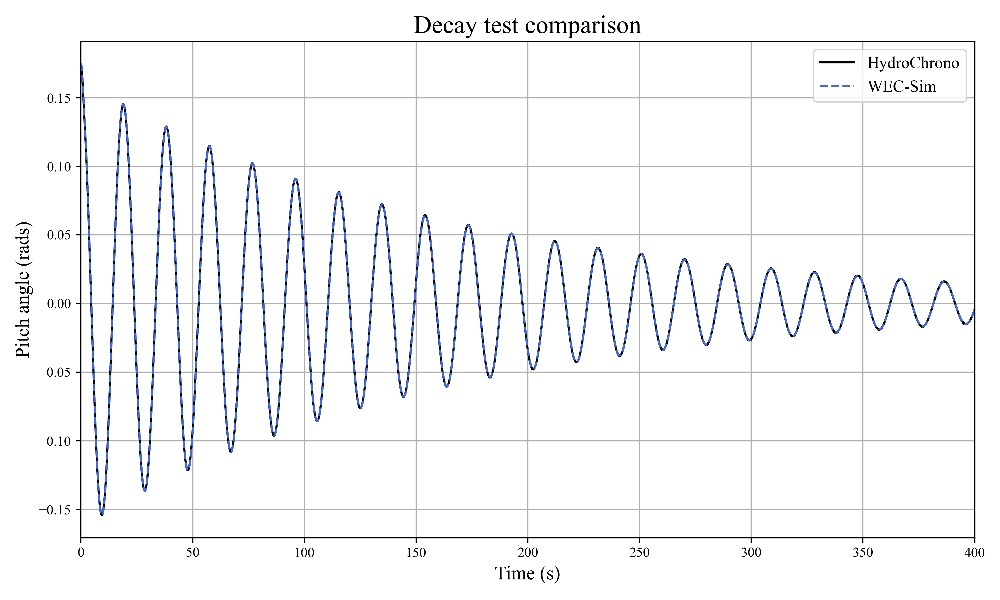

###############################################################
Oscillating Surge Wave Energy Converter (OSWEC) - Verification
###############################################################

Overview
========

The Oscillating Surge Wave Energy Converter (OSWEC) is the verification case tested in this section, using the example model provided in the WEC-Sim package :cite:`WEC-SimReference`. The verification process serves as a comparative measure against WEC-Sim results for assessing the accuracy of HydroChrono.

.. figure:: images/oswec_model.png
   :scale: 25%
   :alt: Image

   Visualization of OSWEC. Left\: hydrodynamic mesh for coefficient computation. Right\: OSWEC system in the Chrono GUI.

Model Parameters
================

The OSWEC model's fundamental physical parameters—such as hinge location, center of gravity, and flap mass—are shown in the following table.

.. raw:: html

    

    <table border="1" style="width:80%;">
      <caption>General Properties of the OSWEC Model</caption>
      <thead>
        <tr>
          <th>Name</th>
          <th class="center-text">Symbol</th>
          <th class="center-text">Value</th>
          <th class="center-text">Units</th>
        </tr>
      </thead>
      <tbody>
        <tr>
          <td>Hinge Location, \(x_{Hinge}\)</td>
          <td class="center-text">\[ \begin{bmatrix} 0.0 \\ 0.0 \\ -8.9 \end{bmatrix} \]</td>
          <td class="center-text">\[ \text{m} \]</td>
        </tr>
        <tr>
          <td>Flap Center of Gravity, \(C_{G}\)</td>
          <td class="center-text">\[ \begin{bmatrix} 0.0 \\ 0.0 \\ -3.9 \end{bmatrix} \]</td>
          <td class="center-text">\[ \text{m} \]</td>
        </tr>
        <tr>
          <td>Flap Mass, \(m_{flap}\)</td>
          <td class="center-text">\[ 127 \times 10^3 \]</td>
          <td class="center-text">\[ \text{kg} \]</td>
        </tr>
        <tr>
          <td>Flap Pitch Inertia, \(I_{yy, flap}\)</td>
          <td class="center-text">\[ 1.85 \times 10^6 \]</td>
          <td class="center-text">\[ \text{kg} \cdot \text{m}^2 \]</td>
        </tr>
        <tr>
          <td>Water Depth, \(d_{water\)</td>
          <td class="center-text">\[ 10.9 \]</td>
          <td class="center-text">\[ \text{m} \]</td>
        </tr>
        <tr>
          <td>Water Density, \(\rho_{water}\)</td>
          <td class="center-text">\[ 1000 \]</td>
          <td class="center-text">\[ \text{kg/m}^3 \]</td>
        </tr>
      </tbody>
    </table>

Results
=======

The OSWEC pitch decay tests and Response Amplitude Operators (RAOs) were focused on for HydroChrono verification.

   OSWEC 10-degree pitch decay test, displaying a high degree of correlation between HydroChrono and WEC-Sim results.

.. figure:: images/oswec_pitch_rao_verification.png
   :scale: 25%
   :alt: Image

   RAOs from WEC-Sim and HydroChrono for OSWEC in regular waves, revealing minor discrepancies at the resonance frequency.

The verification of the OSWEC model provides confidence in the numerical implementation of the hydrodynamic forces for rotational degrees of freedom. The OSWEC's base is treated as a separate body in this system, providing some confidence in the multibody hydrodynamics implementation. However, since the base is fixed, further verification is required in order to check the accuracy of hydrodynamic interactions in multibody systems.

References
==========

For further information about the OSWEC model, please refer to the following:

- For an introduction and tutorials on the OSWEC model as a part of WEC-Sim, consult the WEC-Sim user documentation available at `WEC-Sim Tutorials: Oscillating Surge WEC (OSWEC) <https://wec-sim.github.io/WEC-Sim/dev/user/tutorials.html#oscillating-surge-wec-oswec>`_.

- The OSWEC reference model, complete with example files and code, can be accessed from the WEC-Sim GitHub repository in the following directory: `WEC-Sim OSWEC Example <https://github.com/WEC-Sim/WEC-Sim/tree/master/examples/OSWEC>`_.