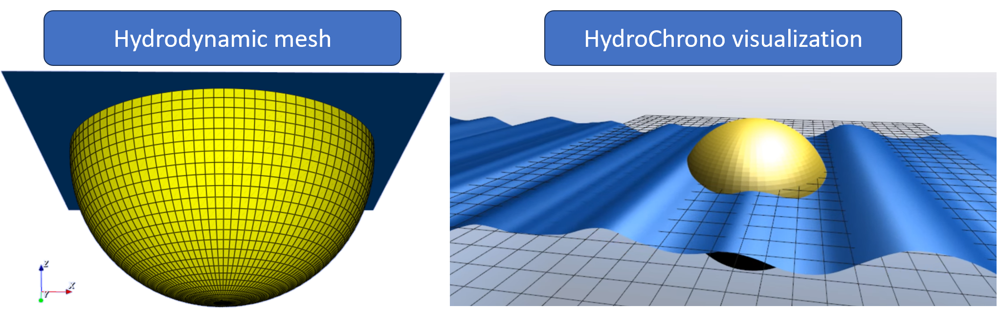
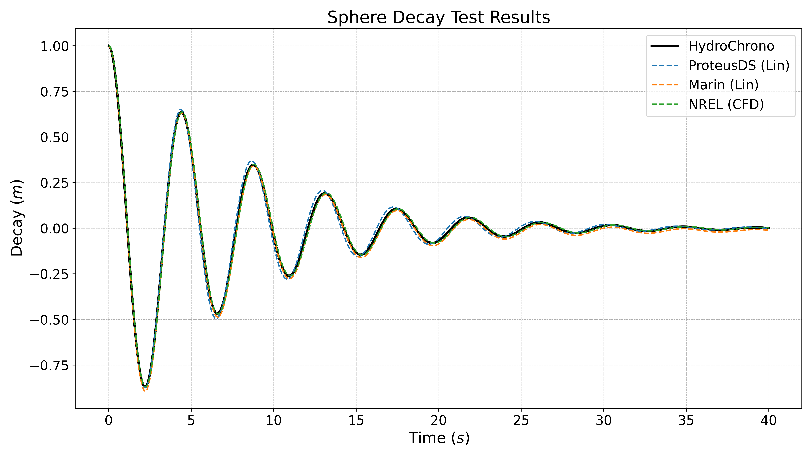

###############################################################
Sphere Model (IEA OES Task 10) - Verification
###############################################################

Overview
========

The Sphere Model was initially developed under the IEA OES Task 10 project :cite:`NiWY2018` to provide a simplified representation of a wave energy converter (WEC) to support the verification of numerical modeling software. The verification results cover a range of testing conditions, including still water decay tests as well as dynamic response analyses in both regular and irregular wave fields. Moreover, some of the Sphere verification results incorporate a damping coefficient to represent a power take-off (PTO).

   Visualization of the Sphere. Left\: the mesh used to compute hydrodynamic coefficients. Right\: visualization of the sphere simulated with HydroChrono in irregular waves.

Model parameters
================

The physical parameters—center of buoyancy, center of gravity, and volume displacement—are crucial for hydrodynamic analysis and are often derived from the geometry and material properties of the sphere.

.. raw:: html

    

    <table border="1" style="width:80%;">
      <thead>
        <tr>
          <th>Name</th>
          <th class="center-text">Symbol</th>
          <th class="center-text">Value</th>
          <th class="center-text">Units</th>
        </tr>
      </thead>
      <tbody>
        <tr>
          <td>Water Density</td>
          <td class="center-text">\( \rho_{\text{water}} \)</td>
          <td class="center-text">\( 1 \times 10^3 \)</td>
          <td class="center-text">\( \text{kg/m}^3 \)</td>
        </tr>
        <tr>
          <td>Gravity</td>
          <td class="center-text">\( g \)</td>
          <td class="center-text">9.81</td>
          <td class="center-text">\( \text{m/s}^2 \)</td>
        </tr>
        <tr>
          <td>Water Depth</td>
          <td class="center-text">\( d \)</td>
          <td class="center-text">\( \infty \)</td>
          <td class="center-text">\( \text{m} \)</td>
        </tr>
		<tr>
          <td>Sphere Mass</td>
          <td class="center-text">\( m \)</td>
          <td class="center-text">\( 261.8 \times 10^3 \)</td>
          <td class="center-text">\( \text{kg} \)</td>
        </tr>
        <tr>
          <td>Sphere Radius</td>
          <td class="center-text">\( r \)</td>
          <td class="center-text">5</td>
          <td class="center-text">\( \text{m} \)</td>
        </tr>
        <tr>
          <td>Sphere Centre</td>
          <td class="center-text">\( \mathbf{C}_{\text{centre}} \)</td>
          <td class="center-text">\[ \begin{array}{c} 0.0 \\ 0.0 \\ 0.0 \end{array} \]</td>
          <td class="center-text">\( \text{m} \)</td>
        </tr>
        <tr>
          <td>Sphere Center of Gravity</td>
          <td class="center-text">\( \mathbf{C}_{\text{G}} \)</td>
          <td class="center-text">\[ \begin{array}{c} 0.0 \\ 0.0 \\ -2.0 \end{array} \]</td>
          <td class="center-text">\( \text{m} \)</td>
        </tr>
      </tbody>
    </table>

Results
======================

Following the numerical simulation, the time-series data of the heave response is compared for model verification.

	Sphere decay test verification results (comparisons against selected IEA OES Task 10 participants).

References
==========

For further information about the sphere model, please refer to :cite:`KrAT2021` and :cite:`WeNY2019`, which provide comprehensive insights into the methodology and validation undetaken for the sphere model.
